# AiccCut

브라우저에서 돌아가는 영상 편집기입니다. 설치 없이 폴더를 받아 실행하면 바로 편집 화면이 열립니다.
화면 문구는 전부 한국어이고, 글꼴은 Pretendard를 씁니다.

[OpenCut](https://github.com/opencut-app/opencut)의 리라이트 코드를 바탕으로 편집기 UI를 새로 만들었습니다.
UI 부품은 [fluid](https://www.fluidfunctionalism.com) 디자인 시스템을 씁니다. 둘 다 MIT 라이선스입니다.

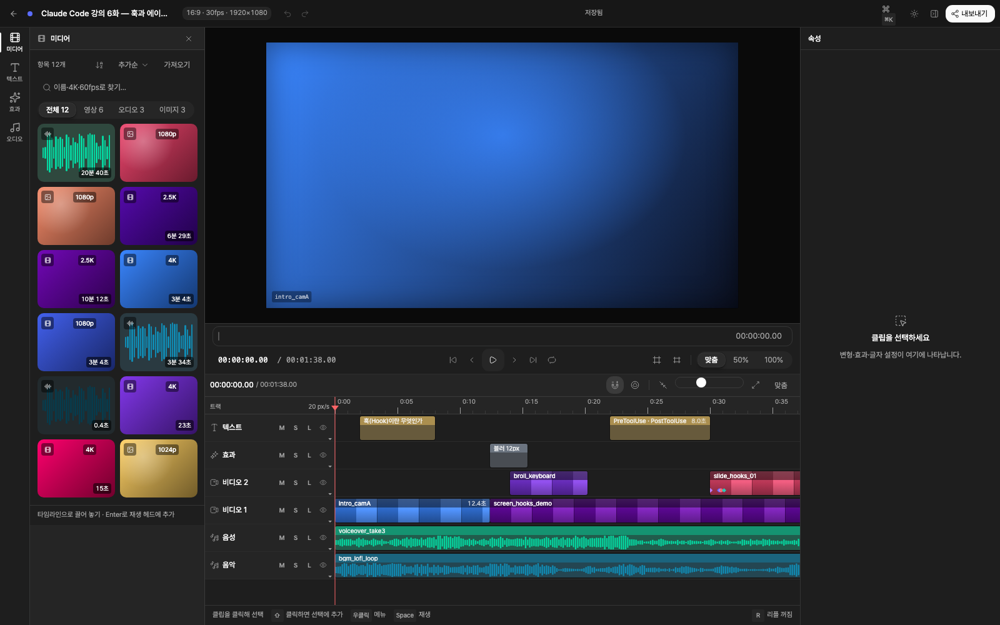

## 실행하기

[Bun](https://bun.sh)만 있으면 됩니다. 터미널에서:

```sh
cd apps/web
bun install
bun run dev
```

브라우저에서 http://localhost:5173 을 엽니다.

처음이라면 [15분 튜토리얼](docs/TUTORIAL.md)을 따라 해 보세요.

## 처음 열면 보이는 것

처음 열면 샘플 프로젝트 6개가 자동으로 만들어져 있습니다. 첫 번째 프로젝트("Claude Code 강의 6화")에는
클립 12개가 들어 있어 편집기의 모든 기능을 바로 눌러볼 수 있습니다. 나머지 5개는 빈 프로젝트입니다.
모든 데이터는 이 브라우저 안에만 저장됩니다.

| 화면 | 설명 |
| --- | --- |
| 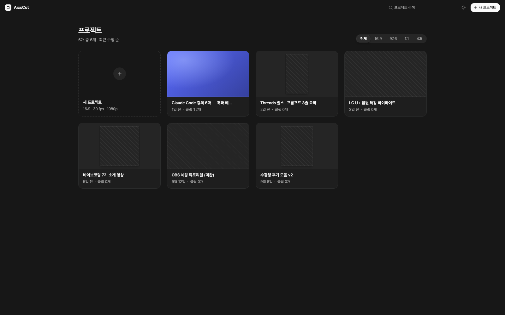 | **홈.** 프로젝트 갤러리. 비율별 필터, 검색, 이름 바꾸기·복제·삭제. |
| 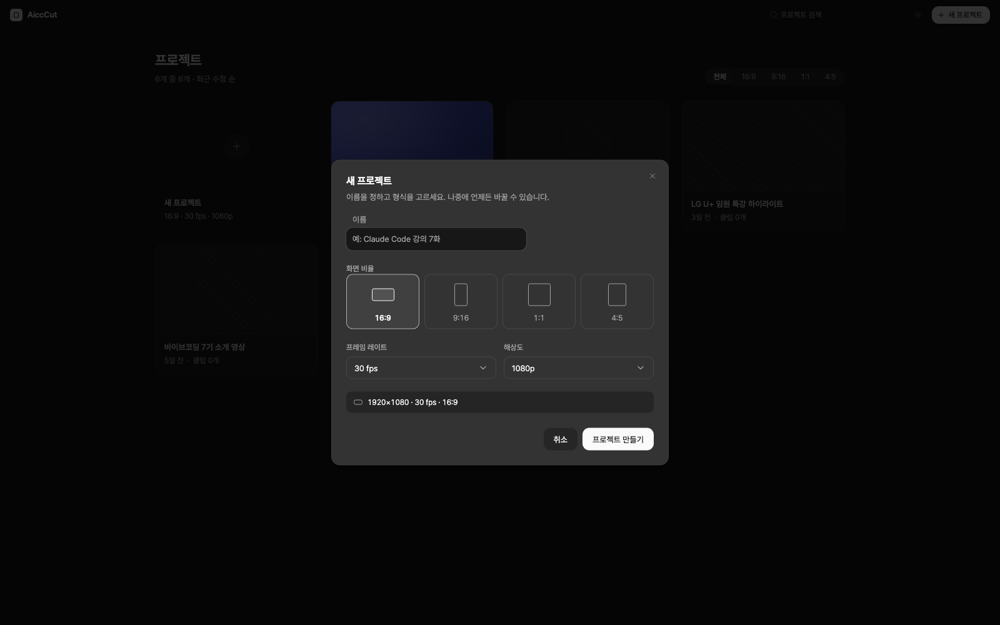 | **새 프로젝트.** 이름, 화면 비율(16:9 · 9:16 · 1:1 · 4:5), 프레임 레이트, 해상도. |
|  | **편집기.** 왼쪽 레일(미디어·텍스트·효과·오디오), 가운데 미리보기와 재생 컨트롤, 아래 타임라인, 오른쪽 속성 패널. |
| 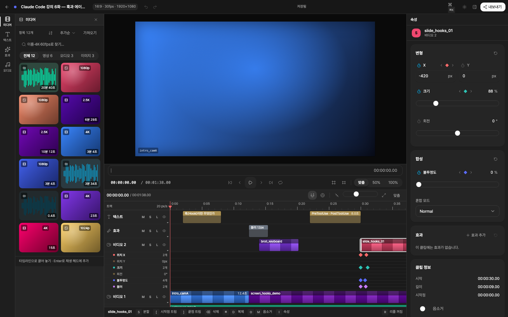 | **클립을 고르면.** 오른쪽에 변형·합성·효과 카드가 채워지고, 타임라인 아래에 키프레임 레인이 펼쳐집니다. |
| 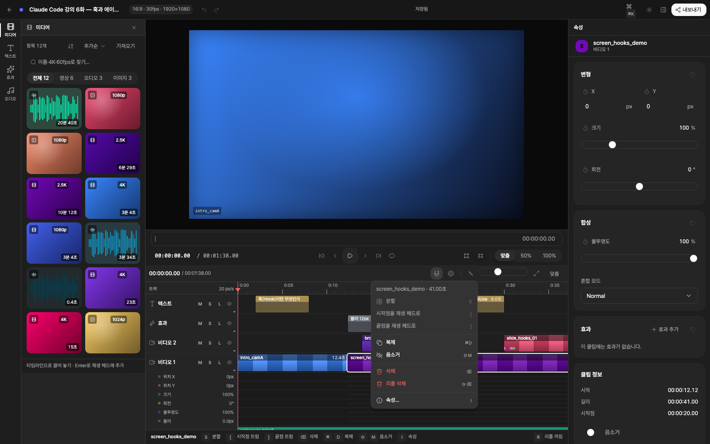 | **우클릭 메뉴.** 분할, 시작점·끝점 트림, 복제, 음소거, 삭제, 리플 삭제. 아래 힌트 바가 단축키를 알려줍니다. |
| 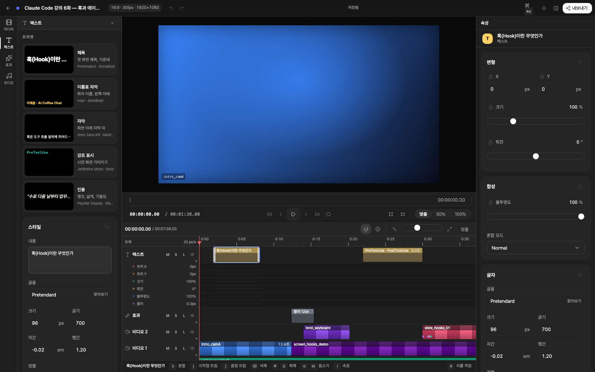 | **텍스트.** 제목·이름표 자막·자막·강조 표시·인용 프리셋, 내용과 스타일 편집. |
| 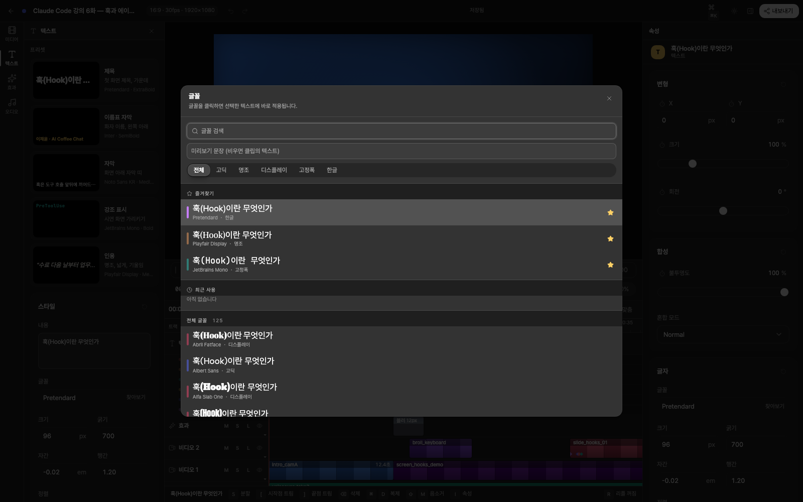 | **글꼴 찾아보기.** 내 문장으로 글꼴 120여 종을 한눈에 비교. 즐겨찾기와 최근 사용. 글꼴은 구글 폰트에서 필요할 때 불러옵니다. |
| 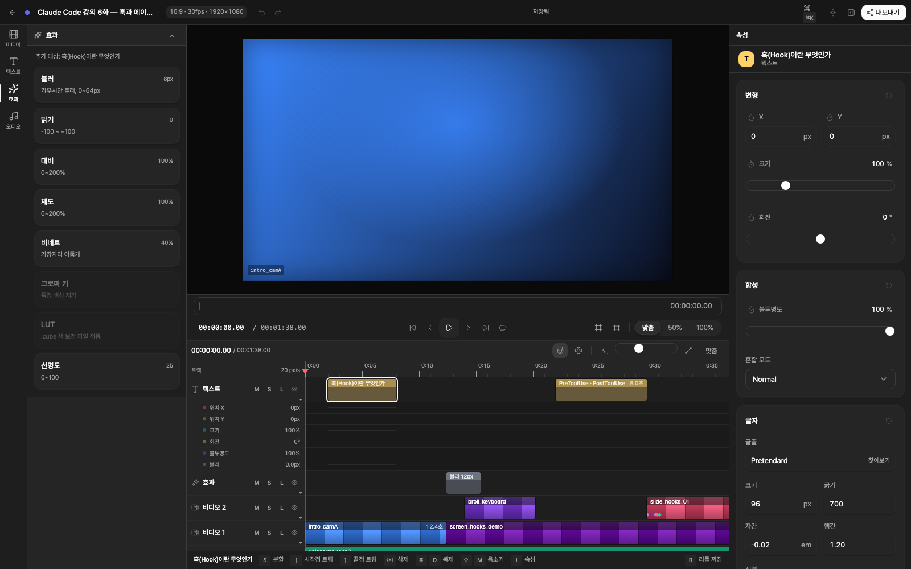 | **효과.** 블러·밝기·대비·채도·비네트·선명도. 선택한 클립에 바로 붙습니다. |
| 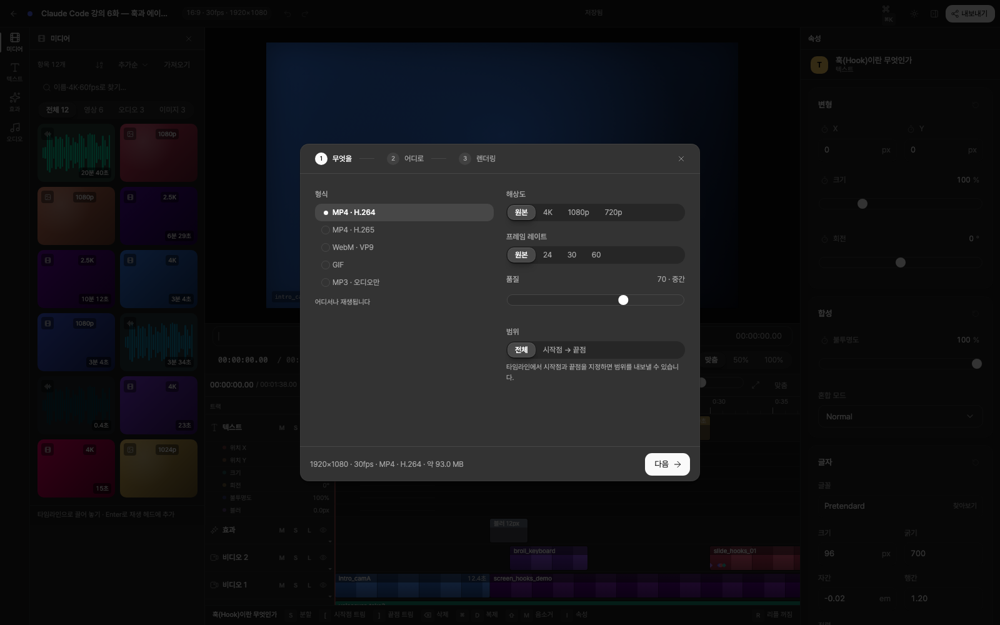 | **내보내기 1단계.** 형식, 해상도, 프레임 레이트, 품질, 범위와 예상 용량. |
| 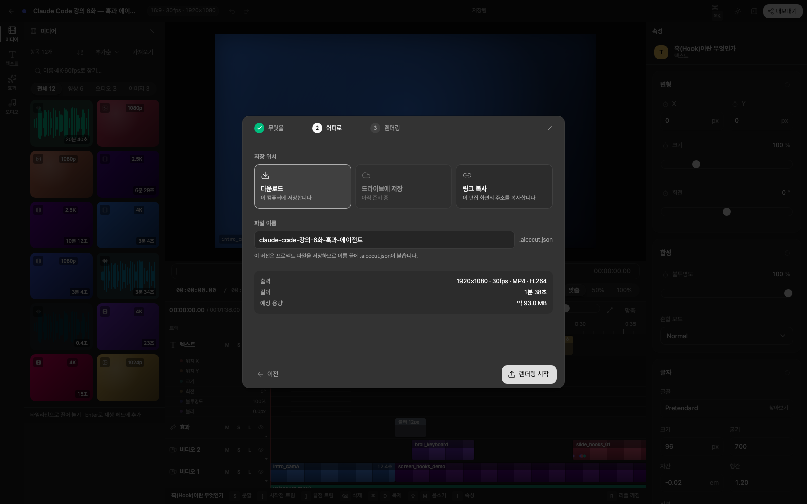 | **내보내기 2단계.** 저장 위치와 파일 이름. |
| 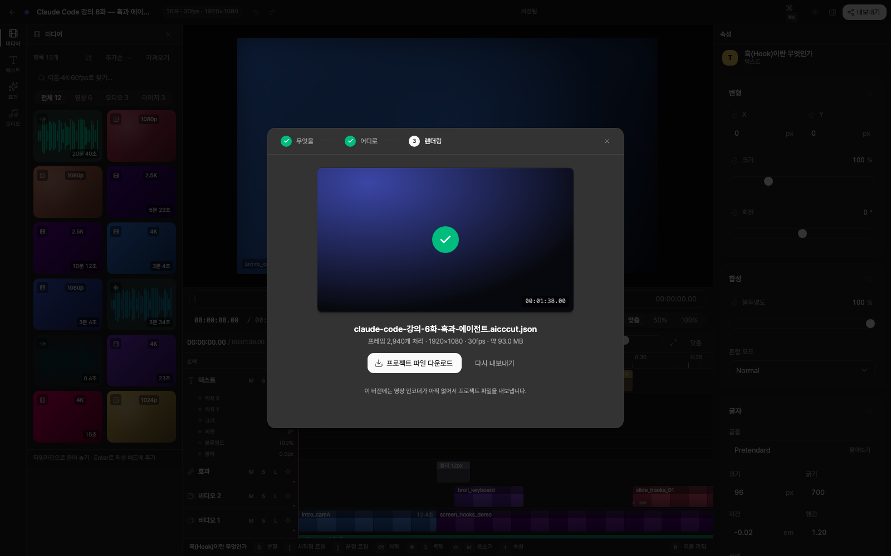 | **내보내기 3단계.** 렌더링 진행률과 남은 시간, 취소. |
| 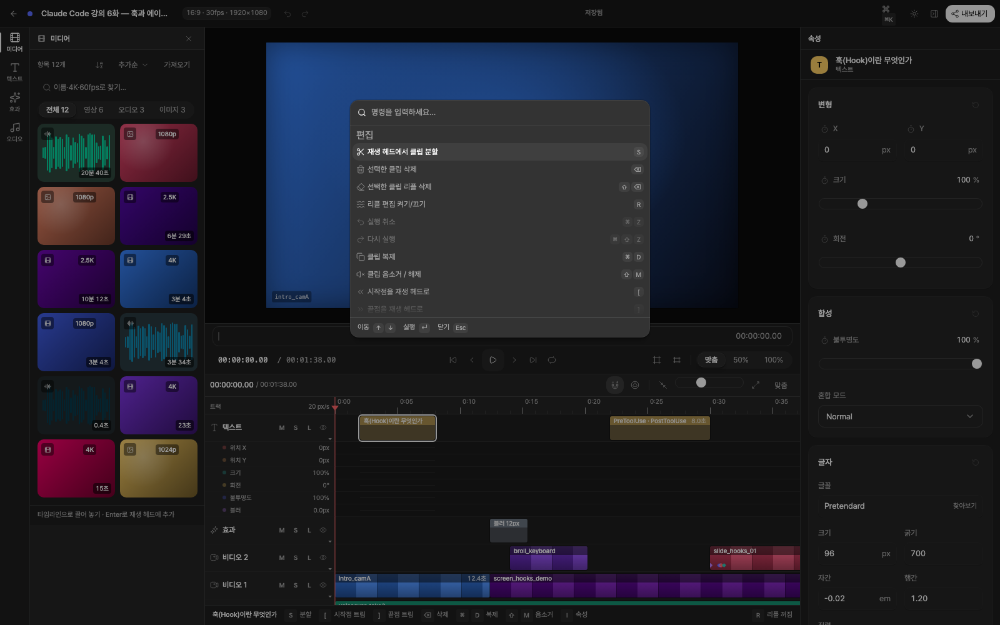 | **⌘K 명령 팔레트.** 명령 46개를 이름으로 찾아 실행. |
| 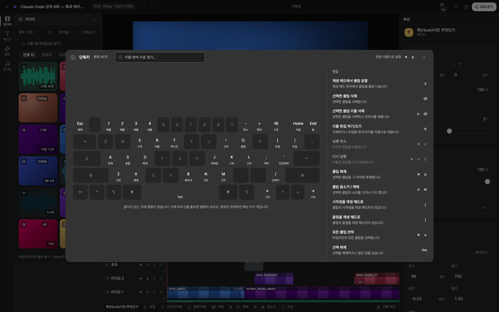 | **? 단축키 화면.** 키보드 그림 위에 단축키가 표시되고, 키를 누르면 바로 실행됩니다. |
| 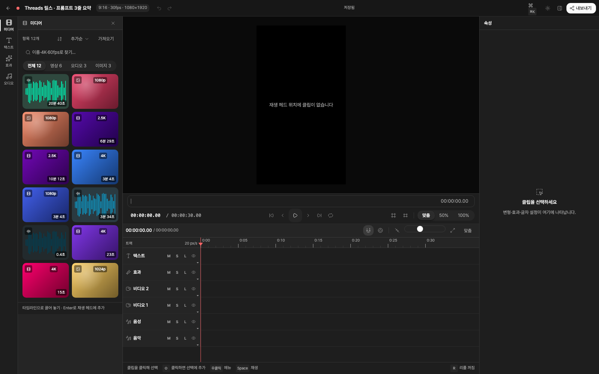 | **빈 프로젝트.** 세로(9:16) 프로젝트. 미디어 패널에 파일을 끌어다 놓으면 시작됩니다. |
| 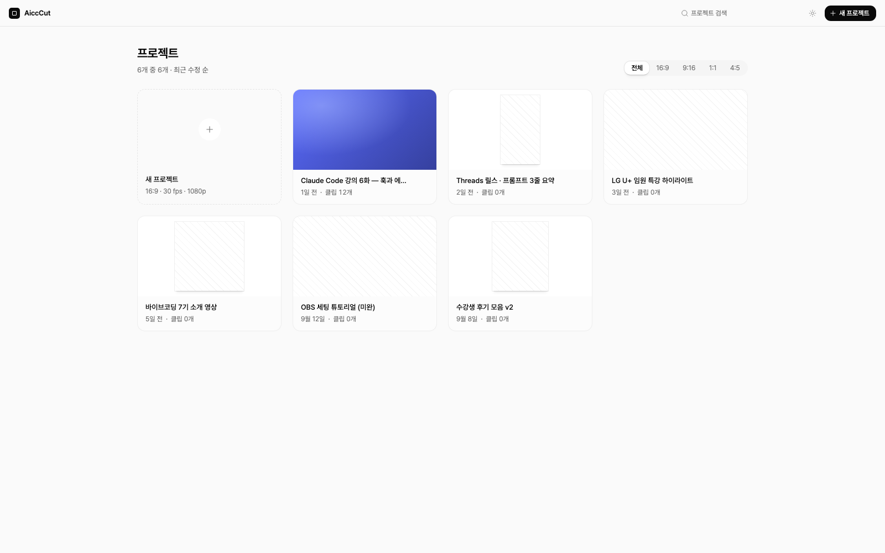 | **밝은 테마.** 상단 해 아이콘으로 전환합니다. |

## 되는 것

- 영상·이미지·음성 파일을 끌어다 놓거나 붙여넣어 가져오기. 실제 썸네일이 뜹니다.
- 타임라인에서 클립 옮기기, 트림, 분할, 리플 편집, 스냅, 실행 취소 100단계.
- 미리보기에서 클립을 직접 끌어 옮기고 크기 바꾸기.
- 위치·크기·회전·불투명도·블러 키프레임 애니메이션.
- 텍스트 클립과 글꼴 브라우저(구글 폰트 120여 종, 필요할 때 자동으로 불러옵니다).
- 명령 팔레트(⌘K)와 단축키 화면(?).
- 자동 저장. 새로고침해도 프로젝트가 남습니다.

## 아직 안 되는 것

- **영상 파일로 내보내기.** 인코더가 아직 없어서, 내보내기는 렌더링 과정을 밟은 뒤 프로젝트 파일(.aicccut.json)을 내려줍니다.
- 가져온 파일은 메모리에만 있습니다. 새로고침하면 색상 타일로 돌아갑니다.
- 오디오 트랙은 재생되지 않습니다. 영상에 붙은 소리만 납니다.

## 구조

```
apps/web/src/editor/
  core/        문서 상태, 히스토리, 재생 시계, 저장, 명령 목록 (모든 영역이 여기만 통해 대화)
  home/        프로젝트 갤러리
  shell/       편집기 틀 (레일, 상단 바, 패널 배치)
  media/       미디어 가져오기와 라이브러리
  preview/     미리보기 합성기와 재생 컨트롤
  timeline/    타임라인, 클립 편집, 키프레임 레인
  inspector/   속성 패널, 텍스트 도구, 효과, 글꼴 브라우저
  export/      내보내기 마법사
  commands/    명령 팔레트와 단축키 화면
```

화면 문구 규칙은 `apps/web/src/editor/GLOSSARY.md`에 있습니다.

## 만든 방법

편집 과정을 13단계로 나누고, 단계마다 서로 다른 방향의 시안 5개를 실제로 동작하게 만든 뒤 하나씩 골랐습니다.
고른 시안 13개를 공용 상태 저장소 위에 합쳐 지금의 편집기가 됐습니다. 시안 갤러리는 커밋 `c873017`에 남아 있습니다.

## 라이선스

MIT. 원본 OpenCut의 저작권은 OpenCut에, fluid 컴포넌트의 저작권은 Micka Touillaud에게 있습니다. `LICENSE` 참고.
